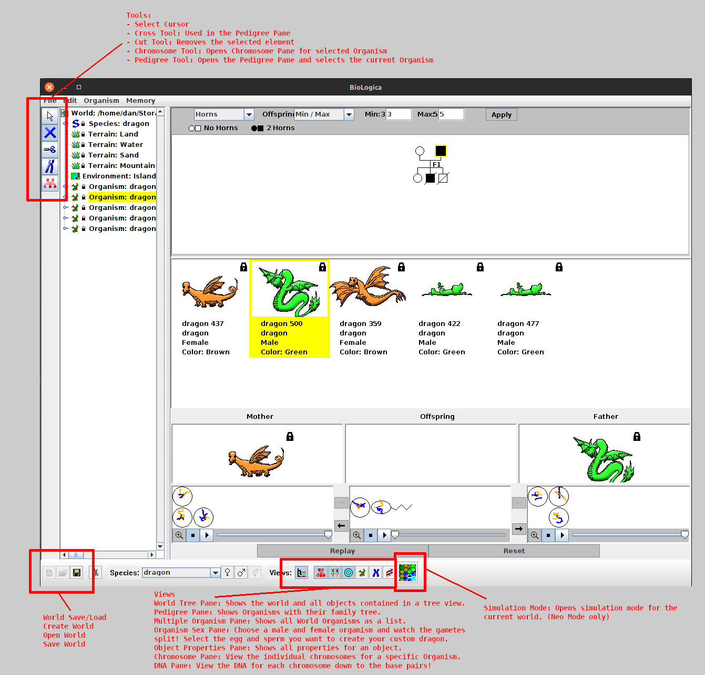
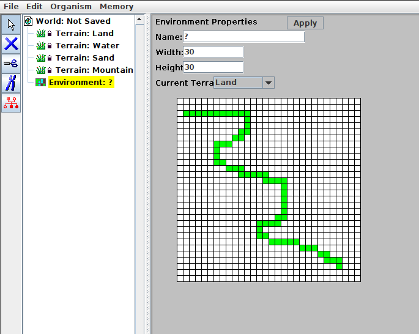
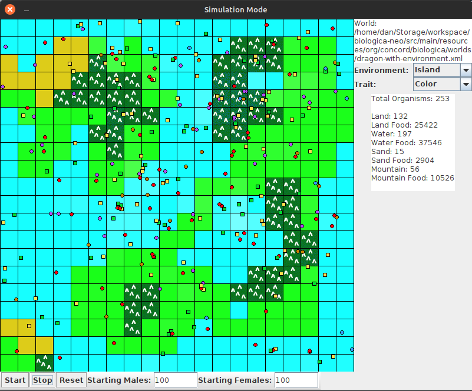
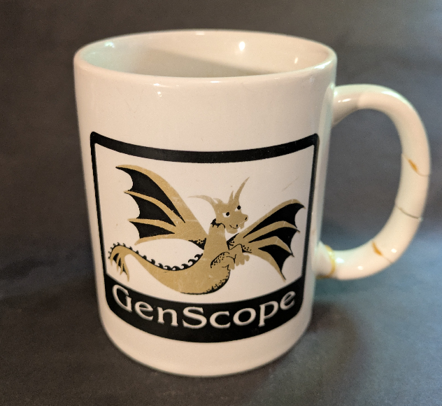

# biologica-neo
A stand-alone version of [Concord Consortium](https://github.com/concord-consortium)'s Java Swing implementation of BioLogica, with some minor fixes/improvements. This ancient version was dredged up and compiled from several source zips and jars from [archive.org](http://archive.org/) and [sourceforge.net](https://sourceforge.net).

### Introduction

Since some time in the mid-to-late 80s, and all the way through the 90s, my father was a huge fan of Macintosh Computers. He worked as a graphic designer, and was always trying to stay on top of his game. As the years went on, we upgraded from the SE to the SE30, and eventually got to even beefier models like the G3 or G4. Around this time, he would often go to computer shows, looking for the newest software; both to use at his job, but also see if he could bring back anything he thought I might enjoy. At one such computer show, he came back with a 3.5 Floppy disk of the software [Genscope](https://genscope.concord.org/). The game (educational software, really) blew my mind and set me on a lifelong love of science and engineering.

Many years have passed since then, and I've come to find that digital archeology is something I'm quite interested in. My experiences working on [jLooch-neo](https://github.com/daniel-david-gabriel/jlooch-neo) and hobby projects in [Java Swing](https://docs.oracle.com/javase/8/docs/api/javax/swing/package-summary.html) gave me what I needed to bring this software back to life.

Of course, when I began my search a couple years ago, I scoured the internet for traces of the original MacOS Classic executable, hoping to run it on one of my ancient macs which rattle and cough up dust when I power them on. However, to my dismay, it could not be found. Even on archive.org, the original installer is simply gone. I do keep an eye out for physical copies of the floppy disk, because mine has also been lost to the ages.

This project is something of a compromise. In my searches, I discovered enough fragments of a working version of `BioLogica` (the Java Swing successor to `Genscope`) to cobble the thing together and drag it kicking and screaming back into the land of the living. While it fell out of common use decades ago, Java Swing is still supported by modern JREs and with some minimal updates, I was able to get it running on a modern JRE.

### What is BioLogica-neo?

BioLogica-neo is a modern update of the Java Swing implementation of BioLogica, which itself is a Java Swing implementation of the original Genscope software. This is meant to be a faithful modernization of the software, preserving as much of the original functionality as possible. For new/expanded functionality, I've isolated the classes into a separate package, and tried to leave the original implementations alone, except where necessary, just like with JLooch-neo.

#### Existing Functionality

Biologica-neo has several modes, but the main one we will cover is the "All-in-one" View. This view contains everything needed to engineer species, breed them, build family trees, and inspect their genes down to the very base pairs! For a brief rundown of the main UI, see below:



#### Neo Features

Biologica-neo, when started in Neo Mode, has a few additions I've made. These are predominantly either attempts to restore existing functionality, or complete features which were under development in the versions I found.

In the All-in-one View, I've made some updates to the World creator:
- When you create a new world, it automatically creates the four Terrains supported by the Simulation Mode within that environment.
- When applying Terrains to an Environment, you can now hold the mouse button down to "paint" the terrains



The biggest addition in BioLogica-neo is Simulation Mode. When you have a World with an Environment and the expected Terrain types, and at least once Species, you can simulate the species living in that world.



In Simulation Mode, you can start or stop the simulation with the given starting conditions based on the number of male and female organisms. You can select different Traits of your Species to see which ones are surviving and which are not.

I've added a new default world `dragon-with-environments.xml` that comes prepared to showcase Simulation Mode.

#### What's Changed?

I had to make some changes to the project to modernize it.

- The original code was made to run on Java 1.4 or earlier. I had to update it to run on Java 1.6 in order to make it compatible with my build tool, Gradle.
- There are some minor formatting changes and changes to take advantage of Java features as well.
- I've updated some of the file structure to separate the Java code from resources.
  - Now code is in `src/main/java` and non-code files are in `src/main/resources`
- I've updated resource loading to be consistent with running the application from the command-line or a Jar.

#### Known Bugs

- Tree View does not play nice with Simulation Mode, but actually, it doesn't play nice with non-neo features either. If you use the Snip or Cut tool on an Organism, it creates a dead leaf in the Tree View that throws exceptions.
- The existing code I found has a number of issues. There are lots of places that will throw exceptions internally and leave the program in a bad state. Save early, save often.

### Building / Running

BioLogica-neo has been updated to run as a Gradle project. You can check out `build.gradle` to see what it's doing, but it will download the archived code from SourceForge and then extract the java libraries from it and use them to compile the project. Some of these are old versions of shared Concord Consortium libraries that are needed to compile the code. Other libraries are external dependencies, like `xerces.jar` which is an old version of Apache Xerces for Java.

> :warning: **Warning:** Since this requires downloading libraries from SourceForge and not the standard sites like MavenCentral, use caution and make sure to scan them before using. Even so, these are old libraries and likely contain vulnerabilities. Be safe. Use at your own risk!

#### Requirements

In order to build and run BioLogica-neo, you will need a version of Java that supports compatibility mode with Java 1.6 (I used OpenJDK 11). Note: To build the project, you will need the JDK version, not just the JRE. Newer versions should work, so long as they support Java 1.6.

You may want to install Gradle on your own, but I have provided the Gradle Wrapper in the project.

#### How to Build/Run

To build the project, you can use your local Gradle, or the version of Gradle Wrapper which I have included.

To build:

```
./gradlew clean build
```

Your compiled jar will be in `build/libs/biologica-neo.jar`. To run it:

```
java -jar build/libs/biologica-neo.jar
```

Alternatively, you can open the project in your favorite IDE and run it from there. If you need the libraries, you can run:

```
./gradlew clean copyLibs
```

#### Running Other Main Classes

By default, the jar uses the Main class `com.gabriel.ui.AllInOneWindow` in the Jar manifest. I've provided the other available classes in `build.gradle`. If you comment out the line with `com.gabriel.ui.AllInOneWindow` and uncomment the line with the class you desire, then when you rerun `./gradlew clean build` it will make the Jar with your specified class.

If you are running the project from your favorite IDE, you can simply run the class from there. All available starter classes will have a `public static void main()` method.

### Notes

Some other notes about BioLogical-neo:

- License is LGPL2. The original Java code was released under this license, so that's what license I use.
- This project wasas originally written for Java on MacOS and Windows, however I'm on Linux. Java Swing is pretty flexible and works on just about any platform. I've tried to make things as platform-agnostic as possible, but there's probably some linux-based assumptions in there somewhere.
- The dependencies, like the code, are ancient! There are probably about a million security vulnerabilities. Use at your own risk!
- Did you use AI for any part of this prject? No :)


